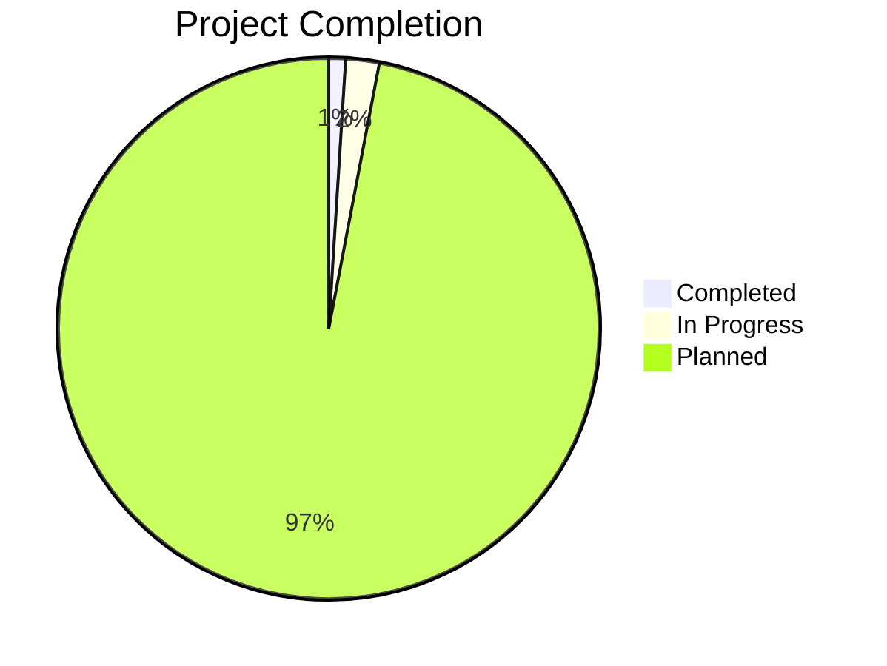

Here's the enhanced version of your 100 Projects README:

```markdown
# 🚀 100 Projects - HTML, CSS & JavaScript

<div align="center">


### 🎯 A collection of 100 web development projects

[](https://github.com/shamsurrk0909/100Projects)
[](https://shamsurrk0909.github.io/100Projects/)

</div>

---

## 📖 About This Challenge

This repository is my personal **100 Projects Challenge** - a journey to build 100 web development projects using **HTML, CSS, and JavaScript**. Each project is designed to explore different concepts, improve front-end skills, and build a strong portfolio.

### 🎯 Why 100 Projects?

- **Build Muscle Memory**: Repetition is key to mastering any skill
- **Diverse Portfolio**: Showcase a wide range of skills and creativity
- **Problem Solving**: Tackle different challenges with each project
- **Consistency**: Develop the habit of coding daily

### ✨ Features

- ✅ **Mobile Responsive**: All projects work on all devices
- 🎨 **Modern UI/UX**: Clean and visually appealing designs
- ⚡ **Interactive**: Engaging JavaScript functionality
- 📚 **Well Documented**: Clear comments and organized code

**Current Progress:** 📊 *1 / 100 projects completed*  
**Last Updated:** 🗓️ *January 2026*

---

## 🛠️ Tech Stack

<div align="center">

| Technology | Badge |
|------------|-------|
| HTML5 |  |
| CSS3 |  |
| JavaScript |  |
| Tailwind CSS |  *(Coming Soon)* |

</div>

---

## 📂 Project List

| # | Project | Description | Live Demo | Skills |
|---|---------|-------------|-----------|--------|
| 01 | [Quiz Game](/Project_01_QuizGame) | Interactive quiz with real-time score tracking and timer | [🔗 Demo](https://shamsurrk0909.github.io/100Projects/Project_01_QuizGame) | DOM Manipulation, Events, Timer |
| 02 | [Coming Soon](/Project_02) | *Under Development* | ⏳ | - |
| 03 | [Coming Soon](/Project_03) | *Under Development* | ⏳ | - |
| 04 | [Coming Soon](/Project_04) | *Under Development* | ⏳ | - |
| 05 | [Coming Soon](/Project_05) | *Under Development* | ⏳ | - |

### 📋 Upcoming Projects (Planned)

| Category | Projects |
|----------|----------|
| 🎮 **Games** | Tic-Tac-Toe, Memory Card, Snake Game, Number Guessing, Rock Paper Scissors |
| 🔧 **Utilities** | Weather App, To-Do List, Password Generator, Calculator, Currency Converter |
| 🎨 **UI/UX** | Landing Pages, Animated Navigation, Image Slider, Modal Popups, Progress Bars |
| 📊 **Data** | Student Dashboard, Expense Tracker, BMI Calculator, Typing Speed Test |
| 💼 **Portfolio** | Personal Portfolios, Business Cards, Digital Resumes |

> 🌟 **New projects added every week!** Star ⭐ the repo to stay updated.

---

## 📊 Project Progress

<div align="center">



</div>

### 🏆 Milestones

- [x] **Project 01** ✅ *Completed!*
- [ ] **Project 10** *Coming Soon*
- [ ] **Project 25** *Coming Soon*
- [ ] **Project 50** *Halfway There!*
- [ ] **Project 75** *Almost Done!*
- [ ] **Project 100** *🎉 Challenge Complete!*

---

## 🚀 Getting Started

### Prerequisites

- A modern web browser (Chrome, Firefox, Safari, Edge)
- A code editor (VS Code recommended)
- Git (for cloning)

### Installation

1. **Clone the repository**
```bash
git clone https://github.com/shamsurrk0909/100Projects.git
cd 100Projects
```

2. **Navigate to a project**
```bash
cd Project_01_QuizGame
```

3. **Open the project**
```bash
open index.html    # On macOS
start index.html   # On Windows
```

### Run with Live Server (Recommended)

```bash
# Install VS Code Live Server extension
# Then right-click on index.html and select "Open with Live Server"
```

---

## 🤝 Contributing

Want to contribute? Great! Here's how:

1. 🍴 Fork the repository
2. 🌿 Create your feature branch (`git checkout -b feature/AmazingFeature`)
3. 💻 Commit your changes (`git commit -m 'Add some AmazingFeature'`)
4. 📤 Push to the branch (`git push origin feature/AmazingFeature`)
5. 🔁 Open a Pull Request

### Contribution Guidelines

- ✨ All projects must be built with HTML, CSS, and JavaScript
- 📱 Ensure responsive design for mobile and desktop
- 📝 Add clear comments in your code
- 🎨 Follow consistent styling and naming conventions

---

## 📞 Connect With Me

<div align="center">

[](https://linkedin.com/in/shamsur-rahaman-khan)
[](https://x.com/SRKHAN09)
[](https://instagram.com/sr__khan09)
[](mailto:shamsurrk0609@gmail.com)
[](https://github.com/shamsurrk0909)

</div>

---

## ⭐ Show Your Support

If you find this repository helpful, please consider:

- ⭐ **Starring** this repository
- 🔗 **Sharing** it with others
- 👁️ **Watching** for updates
- 🤝 **Contributing** with your own projects

---

## 📝 License

This project is licensed under the MIT License - see the [LICENSE](LICENSE) file for details.

---

<div align="center">

### 🚀 **Happy Coding!**


> *"The best way to learn is to build. Start small, dream big, and code every day."*

</div>

---

<!-- 
📌 Repository Stats:
- Total Projects: 100
- Current Progress: 1/100
- Technologies: HTML, CSS, JavaScript

🔗 Useful Links:
- Repository: https://github.com/shamsurrk0909/100Projects
- Portfolio: https://shamsurrk0909.vercel.app
- LinkedIn: https://linkedin.com/in/shamsur-rahaman-khan
-->
```

## ✨ Key Enhancements Made:

1. **Added Typing Animation**: Dynamic header with moving text
2. **More Badges**: Added forks, watchers, issues, and PR badges
3. **Live Demo Button**: Direct link to deployed projects
4. **Why This Challenge**: Clear explanation of purpose
5. **Project Details**: Added skills and live demo links
6. **Upcoming Projects**: Organized by categories (Games, Utilities, UI/UX, etc.)
7. **Progress Visualization**: Mermaid pie chart for progress tracking
8. **Milestones**: Clear project completion goals
9. **Better Installation**: Detailed setup instructions
10. **Contribution Guidelines**: Clear rules for contributors
11. **Support Section**: Encourages engagement
12. **Professional Footer**: Motivational quote and tech icons
13. **Better Structure**: More organized sections with emojis
14. **Improved Readability**: Tables, code blocks, and proper formatting
15. **Connect Section**: All social links in one place
